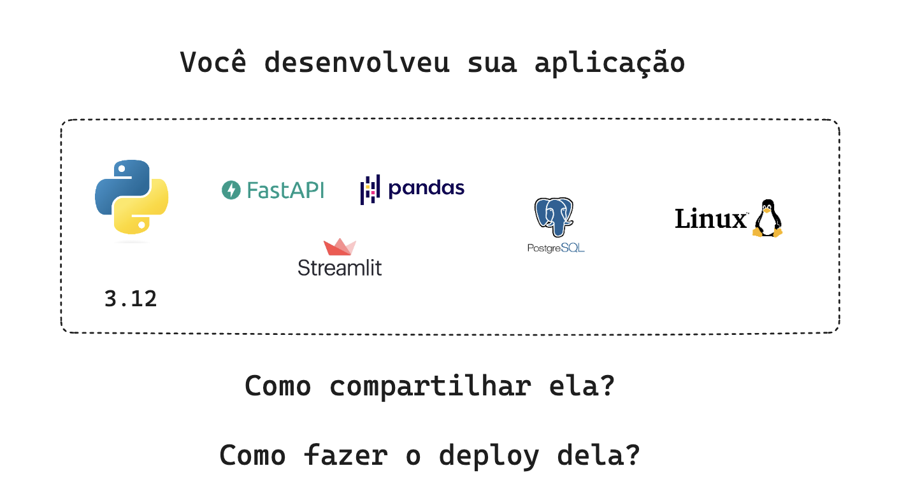
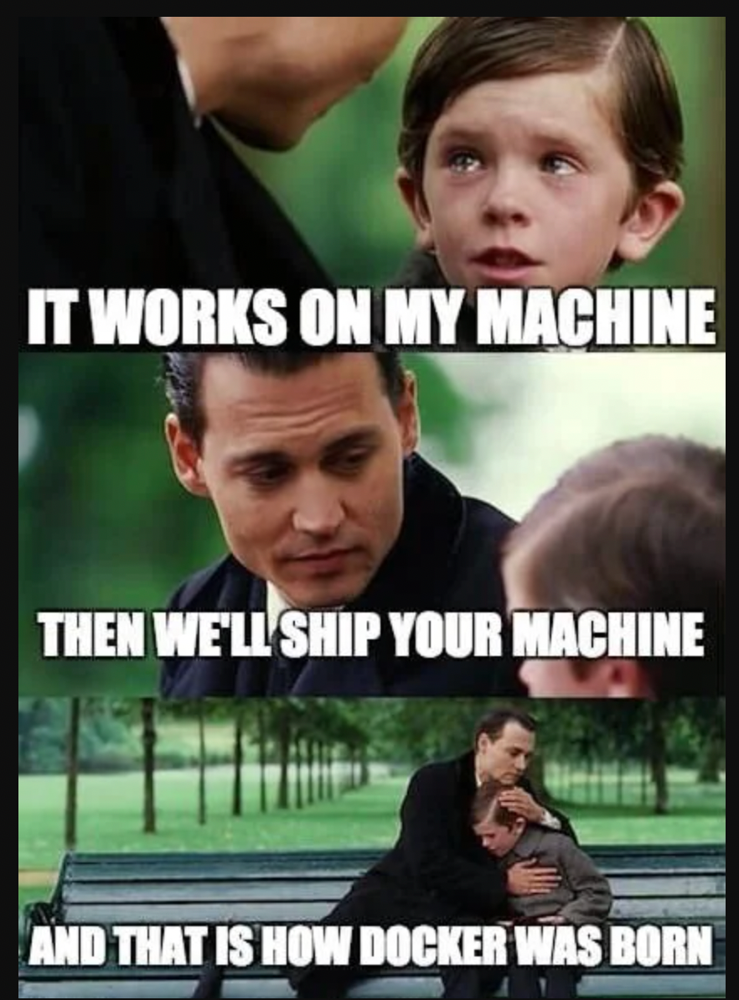
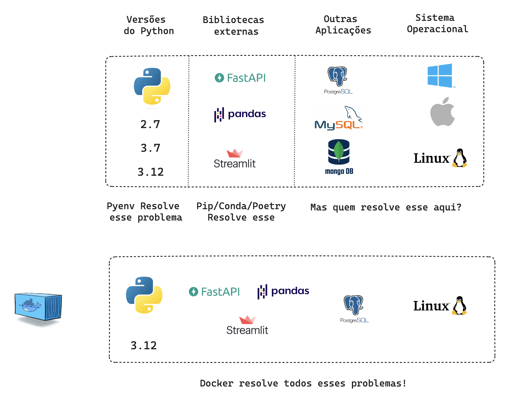

# Do Jupyter Notebook pro Deploy em Prod

Repositório do Workshop do Jupyter Notebook pro Deploy em Prod.

## Objetivo

O objetivo desse workshop é mostrar como é possível fazer o deploy de vários tipos de produtos de dados, passando desde a etapa de especificação até a fase de deploy.

Fazem parte dessa solução:

[FastAPI](https://github.com/lvgalvao/API-Do-Jupyter-Notebook-Pro-Deploy)

[Banco SQL](https://github.com/lvgalvao/SQL-Do-Jupyter-Notebook-Pro-Deploy)

[Apache Airflow](https://github.com/lvgalvao/AIRFLOW-Do-Jupyter-Notebook-Pro-Deploy)

[Streamlit](https://github.com/lvgalvao/STREAMLIT-DoJupyter-Notebook-Pro-Deploy)

## Plano de aula

- [x] Introdução
- [ ] FastAPI
- [ ] Instalando nossas dependências
- [ ] Criar nossa primeira API
- [ ] Implementar nossos testes
- [ ] Implementar nossa CI
- [ ] Criando nossa View
- [ ] Adicionando nosso Schema
- [ ] Pydantic já trabalhando
- [ ] Adicionando nosso banco de Dados
- [ ] Criando nossa tabela
- [ ] Criando nosso projeto de dados
- [ ] Subindo o PostGres para o Render
- [ ] Refatorando nosso código, pasta Test, Schema, Nosso Router (Esse é BRABO!)
- [ ] Subindo o FastAPI para o Render
- 11h30

- [ ] Airflow - 40 min
- [ ] Datadog - 20 min
- [ ] Stremlit - 20 min

## Docker

Imagine que você tem uma aplicação que tenha Python 3.7, Pandas 2.1, Stremlit 1.4, FastAPI 0.1.7, Postgres 16 e você utiliza um Mac. 

- Como você garante que essa aplicação vai funcionar em todos os sistemas? Afinal você não trabalha sozinho.

- Como garantir que o seu amigo que tem um Mac vai conseguir rodar sua aplicação?
  
- Como garantir que o seu servidor de produção em Linux vai conseguir rodar sua aplicação?

Essa é a razão do famigerado "na minha máquina funciona"

O Docker é uma ferramenta que permite a criação de ambientes isolados para a execução de aplicações. Isso significa que, ao utilizar o Docker, você pode GARANTIR QUE SUA APLICAÇÃO IRÁ FUNCIONAR da mesma forma em diferentes ambientes, seja no seu computador com windows, do seu colega de trabalho com Mac e no servidor de desenvolvimento ou no servidor de produção em Linux.

É um mundo utópico onde todos os sistemas operacionais funcionam da mesma forma. E isso é possível graças ao Docker.

Independente de onde sua aplicação vai estar rodando, você pode garantir que ela vai funcionar da mesma forma.

Parece surreal não é mesmo? Mas é real!

Ele trabalha com o conceito de contêineres, que são ambientes isolados que contém tudo que sua aplicação precisa para funcionar. Isso inclui o sistema operacional, as bibliotecas, as dependências e tudo mais que for necessário. 

Para engenheiros e analistas de dados, entender e aplicar essa prática significa garantir que as aplicações de processamento de dados e APIs desenvolvidas sejam robustas, consistentes e seguras. A utilização de contêineres permite a criação de ambientes isolados que são cruciais para testes e produção de modelos de análise de dados, garantindo que as aplicações funcionem igualmente bem em diferentes infraestruturas e estágios de desenvolvimento.

### Instalação do Docker

- [Instalação Docker](https://docs.docker.com/engine/install/ubuntu/)

### O que é uma imagem?

Você só precisa configurar uma imagem uma vez e, a partir dela, pode criar quantos containers quiser.

Uma imagem é um pacote executável que inclui tudo o que é necessário para executar uma aplicação - o código, um tempo de execução, bibliotecas, variáveis de ambiente e configurações. As imagens se tornam containers em tempo de execução e, no caso do Docker, as imagens se tornam containers quando executadas no Docker Engine. Os containers do Docker são executados sempre no modo isolado, garantindo que os processos em execução no container não interfiram e nem acessem os processos em execução no host e vice-versa.

### Comandos básicos

- `docker ps`: Lista os containers em execução no momento.

- `docker ps -a`: Lista todos os containers, independentemente de estarem em execução ou não.

- `docker run NOME_DA_IMAGEM`: Cria um container com a respectiva imagem passada como parâmetro.

- `docker run -it NOME_DA_IMAGEM`: Conecta o terminal que estamos utilizando com o do container.

